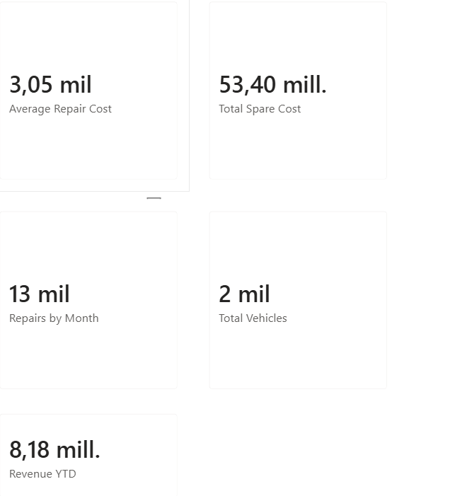
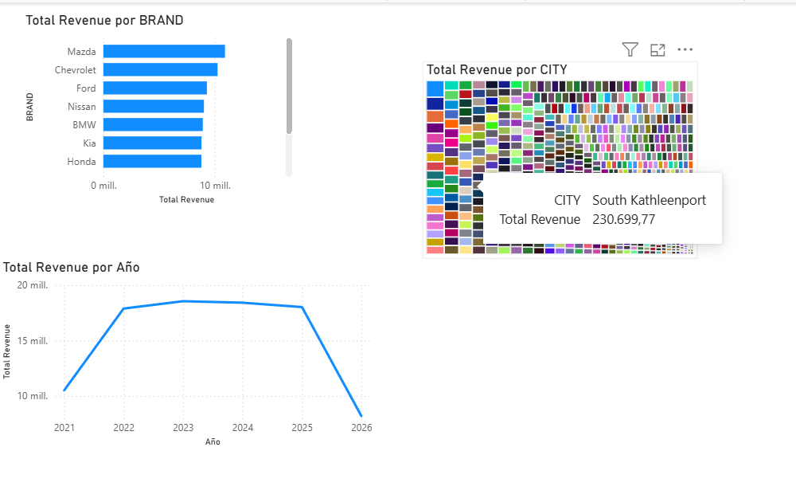
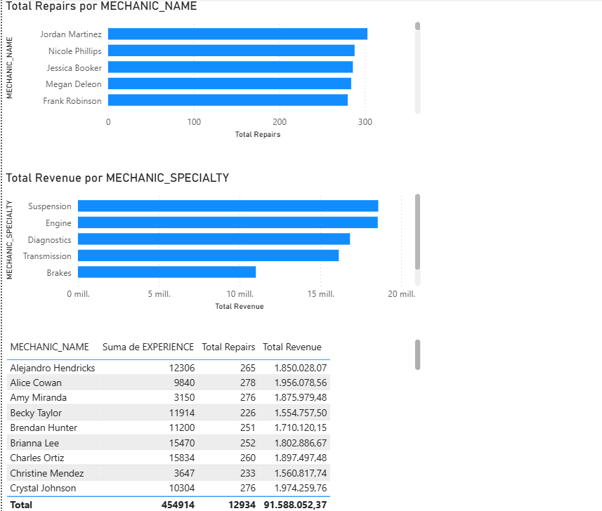
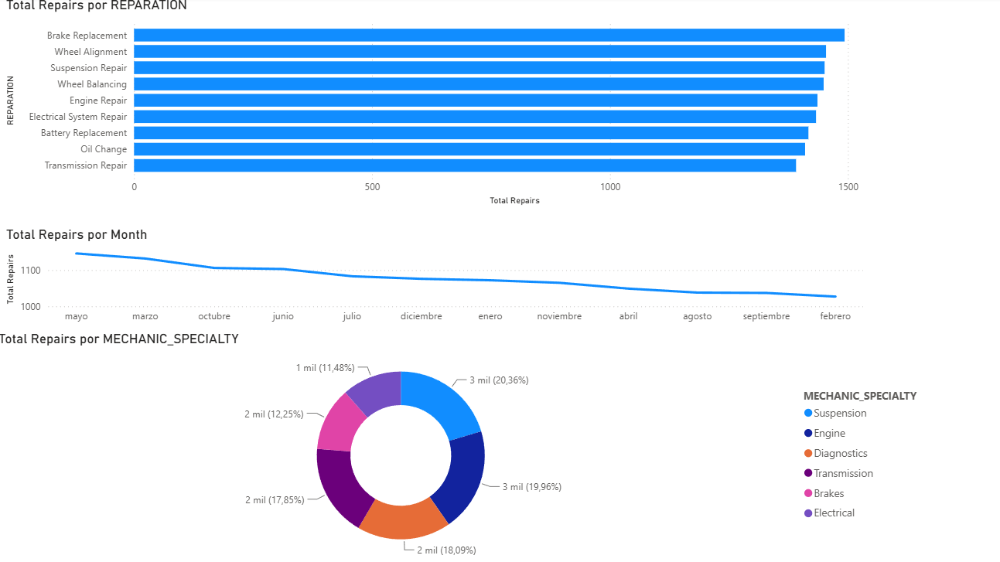

Este es un laboratorio donde se analizan datos de una empresa que se didica a la reparación de automoviles y ventas de piezas.

## Descripción

Laboratorio práctico donde se analizan datos sobre tipos de reparaciones frecuentes, partes de autos más vendidas, marcas de autos más frecuentes en el taller, mécanicos con mayor reparaciones y más.

# Objetivo

Analizar los datos para brindar información más fácil de comprender y presentar a la alta gerencia, obtener datos como la ganancia, las estimaciones de ganancias y los mejores colaboradores.

---

# Justificación

Poder analizar datos ayuda al crecimiento de las empresas, gracias a brindar una visión clara y objetiva de las ganancias, los mejores colaboradores, los artículos que más se vendadn. etc. esto a su vez permita desarrollar planes estratégicos de cremiento y proyecciones a hacia el futuro de la empresa

---

# Alcance

Los datos utilizados para este análisis son ficticios y fueron creados utilizando el codigo de python.

---

# Dashboard 

La siguiente imagen muestra el dashboard principal donde podremos encontrar las ganacias totales y cuantas reparaciones se realizan en promedio al mes (KPis)

---

# Analisis Financiero
Veremos el total de ganancias por ciudad, marca y año.

Para esta prueba se utilizó Hydra junto con un diccionario de contraseñas para simular un ataque contra el servicio SSH.

  

---

# Desempeño de Mecánicos

Mostraremos el desemepeño de los mecánicos, usando metricas como el total de reparaciones en el año, el tipo de reparación que hicieron y cuanto generaron para la empresa.

  

---

# Ventas

Veremos información sobre las ventas totales por tipo de pieza, y cuanto porcentaje de las ventas representa.

---

# Reparaciones

Con el objetivo de identificar las reparaciones más comunes se crea esta hoja de analisis

---

# Resultados

El análisis del conjunto de datos permitió obtener información sobre las reparaciones realizadas, los vehículos atendidos, los clientes, el desempeño de los mecánicos y el consumo de repuestos.

##Análisis de Reparaciones

Se analizaron los diferentes tipos de reparaciones registrados en el taller, identificando su frecuencia y distribución a lo largo del tiempo.

El análisis permite identificar los períodos con mayor demanda de servicios y determinar los tipos de reparación que representan una mayor carga de trabajo para el taller.

##Análisis Financiero

Se analizaron los costos asociados a las reparaciones y repuestos, permitiendo visualizar el comportamiento financiero según diferentes dimensiones:

- Tipo de reparación
- Marca del vehículo
- Ciudad
- Mecánico
- Tipo de repuesto
- Período de tiempo

## Desempeño de los Mecánicos

El análisis permite evaluar la distribución del trabajo entre los mecánicos considerando:

- Cantidad de reparaciones realizadas
- Especialidad del mecánico
- Cantidad de vehículos atendidos
- Costo promedio de las reparaciones

## Análisis de Vehículos

Se analizaron los patrones de mantenimiento utilizando información como:

- Marca y modelo
- Año
- Millaje
- Cantidad de reparaciones
- Tipo de reparación
- Costos de mantenimiento

## Análisis de Repuestos

Se analizó el consumo de repuestos considerando la cantidad utilizada y su precio unitario.

Esto permite identificar:

- Repuestos más utilizados
- Tipos de repuestos con mayor demanda
- Costos asociados al consumo de repuestos
- Repuestos con mayor impacto en los costos

## Dashboard

Los resultados fueron integrados en dashboards interactivos desarrollados en **Power BI**.

Los dashboards permiten analizar la información mediante filtros por:

- Fecha
- Marca del vehículo
- Ciudad
- Especialidad del mecánico
- Tipo de reparación
- Repuesto

## Indicadores Principales

| Indicador | Resultado |
|---|---:|
| Clientes analizados | 1,000 |
| Vehículos analizados | 2,000 |
| Mecánicos analizados | 50 |
| Repuestos analizados | 300 |
| Reparaciones analizadas | 15,000 |
| Detalles de reparación | 30,000 |
| Tipo de reparación más frecuente | Reemplazo de discos de freno |
| Total de ganancia | 91,59 Mil |
| Coste promedio por reparación | 3,05 Mil |
| Ganancia por año |

> **Nota:** Los datos utilizados en este proyecto fueron generados sintéticamente con fines educativos y de demostración. Los resultados representan el comportamiento del conjunto de datos simulado y no estadísticas reales de un taller automotriz.

---
# Tecnología utiliazda
- **Python** – Generación y preparación de datos
- **Oracle SQL** – Base de datos, consultas, JOINs y vistas
- **Oracle APEX** – Gestión y visualización de la base de datos
- **Power BI** – Análisis y visualización de datos
- **GitHub** – Control y documentación del proyecto
---
